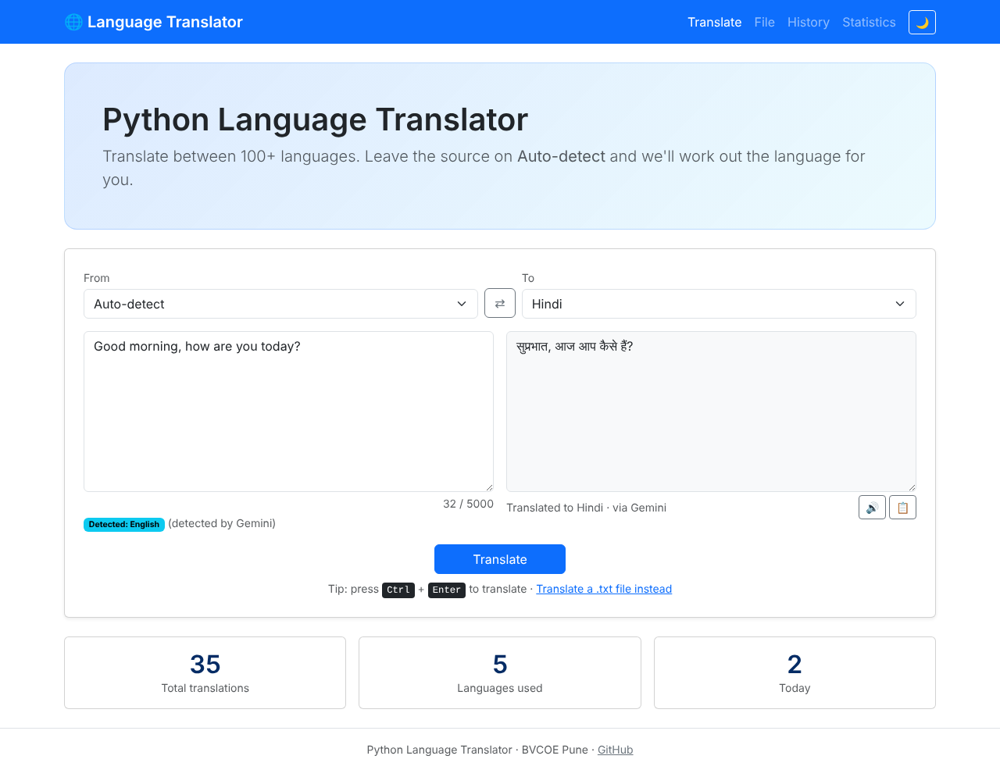
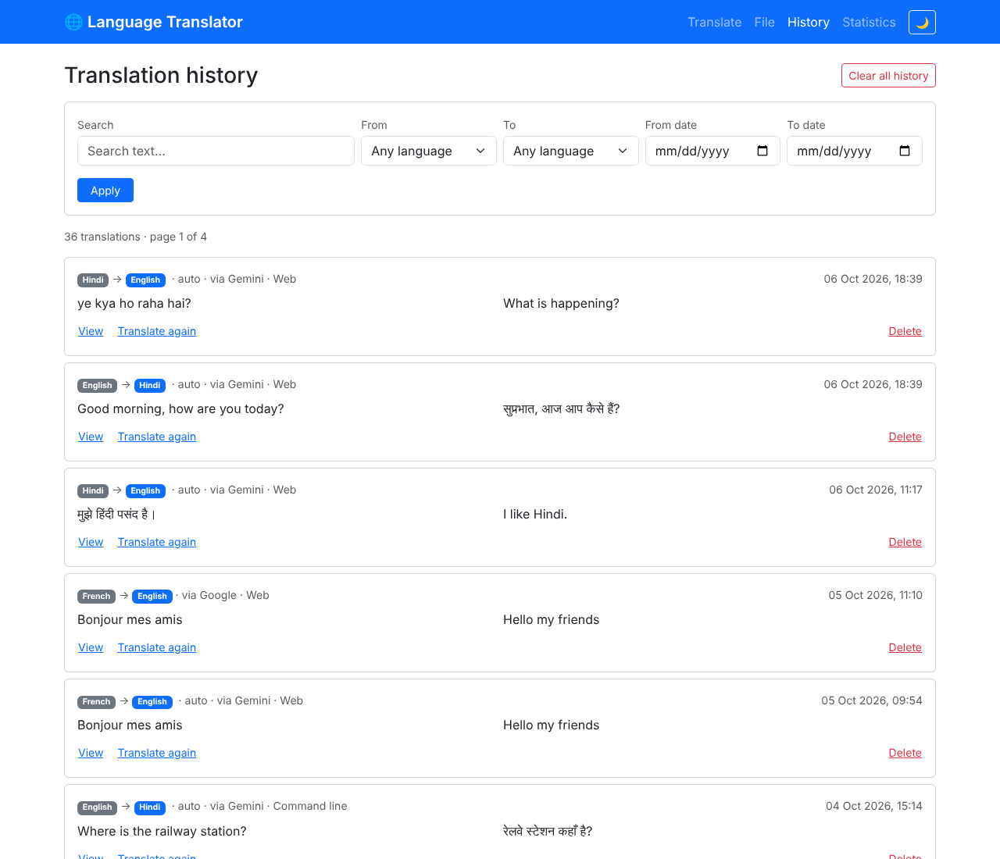
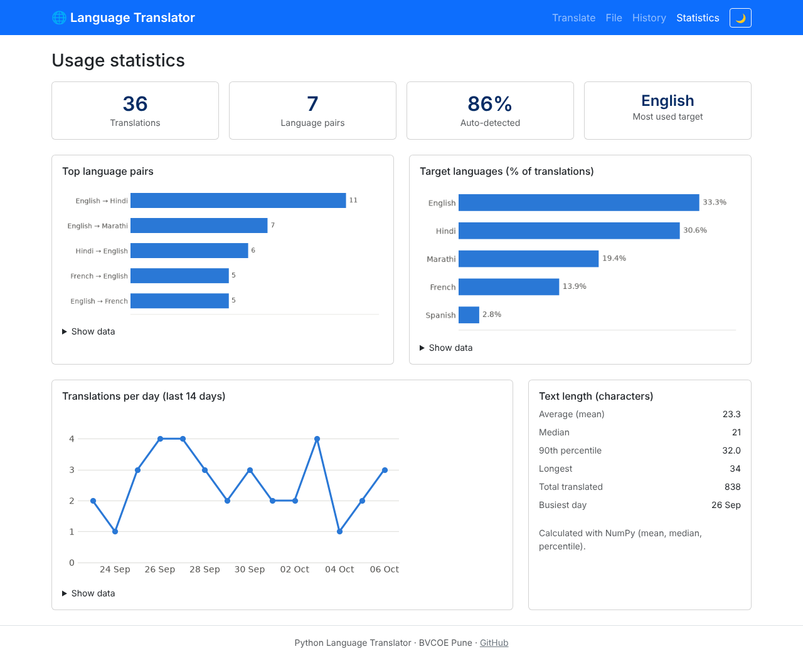
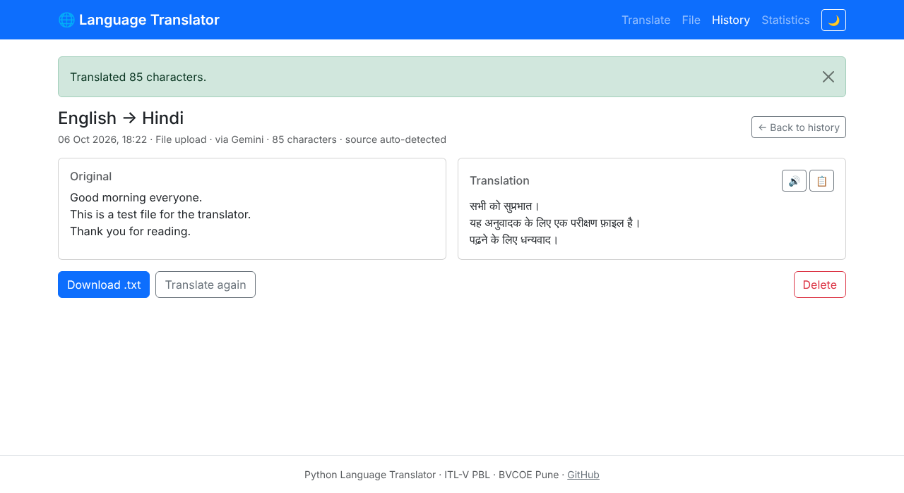
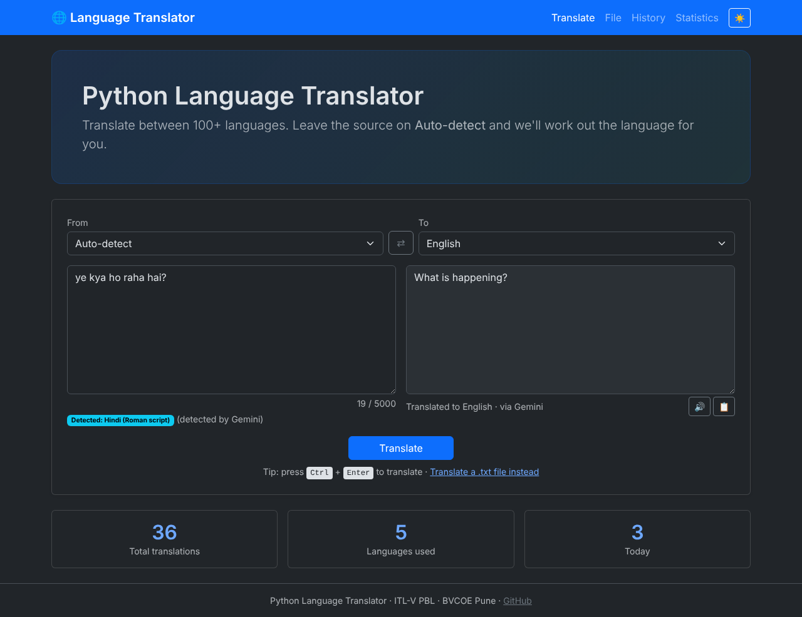
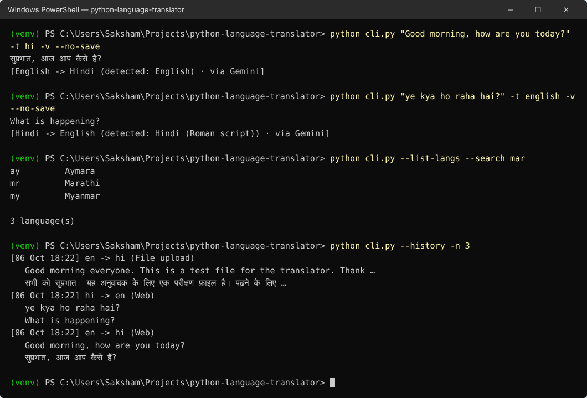

# 🌐 Python Language Translator

A Django web app (with a companion command-line tool) that translates text between 100+ languages, **auto-detects the source language** (including Hindi typed in English letters), keeps a searchable **translation history** in a database, and shows **usage analytics** built with Pandas, NumPy and Matplotlib.

> **Course:** Information Technology Laboratory-V (ITL-V), B.Tech IT, Semester V
> **Institute:** Bharati Vidyapeeth College of Engineering, Pune
> **Type:** Project Based Learning (PBL), individual project
> **Faculty guide:** Prof. Sonali D Mali


---

## Table of contents
- [Features](#features)
- [Tech stack](#tech-stack)
- [Architecture](#architecture)
- [Project structure](#project-structure)
- [Setup](#setup)
- [Usage](#usage)
- [Running the tests](#running-the-tests)
- [Screenshots](#screenshots)
- [Known limitations](#known-limitations)
- [Project management](#project-management)
- [ITL-V syllabus mapping](#itl-v-syllabus-mapping)
- [Author](#author)

## Features

| | Feature | Story |
|---|---|---|
| 🔤 | Translate text between 133 languages | US-01 |
| 🔍 | Auto-detect the source language, with a confidence check; recognises romanized Hindi ("Hinglish") | US-02, #17 |
| 💾 | Every translation saved to the database; live stats on the home page | US-03 |
| 📜 | History page: newest first, 10 per page, full-text view, "translate again" | US-04 |
| 🔎 | Search and filter history by text, languages and date range | US-05 |
| 🗑️ | Delete one translation or clear all, with confirmation | US-06 |
| 🛡️ | Friendly errors (no internet, rate limit, timeout, same language…) and automatic backup engines | US-07 |
| 🤖 | Optional Google Gemini engine (free API key) for high-quality translation and language detection | #20 |
| 📊 | Statistics page: top language pairs, daily usage, target-language share, text-length stats | US-08 |
| 💻 | Command-line translator sharing the same history (`cli.py`) | US-09 |
| 📄 | Upload a `.txt` file (up to 20,000 characters), translated in chunks, download the result | US-10 |
| 🔊 | Listen to the translation (text-to-speech) and copy it with one click | US-11 |
| 🌗 | Light / dark theme toggle that remembers your choice | – |

## Tech stack

| Layer | Technology | Why |
|---|---|---|
| Language | Python 3.10+ | Course language |
| Web framework | Django 5.2 LTS | MVT architecture, ORM, admin, forms, CSRF protection |
| Translation | [deep-translator](https://pypi.org/project/deep-translator/): Google and MyMemory; Google Gemini API via `requests` | Google/MyMemory need no key; Gemini needs a free key and gives the best quality |
| Language detection | [langdetect](https://pypi.org/project/langdetect/) + a rule-based Hinglish check | Offline; tells us *which* language was detected |
| Database | SQLite (default) or MySQL via PyMySQL | MySQL for the syllabus; SQLite for zero-setup development |
| Analysis | NumPy, Pandas | Statistics and grouping on the translation history |
| Charts | Matplotlib (Agg backend, PNG in memory) | Server-side charts in light and dark versions |
| UI | Django templates + Bootstrap 5.3 | Responsive, built-in dark mode, no JS framework |
| Text-to-speech | Browser Web Speech API | Free, offline, no API key |

## Architecture

```
 Browser ──► urls.py ──► views.py ──► forms.py (validation)
                            │
                            ▼
              translator/services/   (plain Python, no Django)
              ├─ languages.py   133 languages, code ↔ name, MyMemory code mapping
              ├─ detection.py   langdetect + Hinglish rule, reliability check
              ├─ engine.py      Google → Gemini → MyMemory fallback, timeout, cool-down
              ├─ gemini.py      Gemini REST client (JSON structured output)
              ├─ chunking.py    generator that splits long text
              └─ analytics.py   Pandas / NumPy / Matplotlib
                            │
                            ▼
                 models.py ──► Django ORM ──► SQLite / MySQL
                            ▲              ▲
 cli.py (argparse) ─────────┘              └── scripts/db_raw_sql.py (raw SQL, DB-API)
```

- **Service layer:** all translation logic lives in `translator/services/` and doesn't import Django, so the website and the CLI share one implementation and it can be unit-tested on its own.
- **Post/Redirect/Get:** after a translation is saved, the page redirects, so refreshing never saves a duplicate.
- **Graceful degradation:** engines are tried in order (Google → Gemini → MyMemory, or `PRIMARY_ENGINE` first). If one refuses (HTTP 429) or times out, the next one is used and the page says which engine translated.

## Project structure

```
python-language-translator/
├── .github/                       # issue templates (user story, bug) + PR template
├── translator_project/            # Django settings (.env-driven) and root URLs
├── translator/
│   ├── services/                  # languages, detection, engine, gemini, chunking, analytics
│   ├── templates/translator/      # base, home, file, history, detail, stats, confirm_delete
│   ├── static/translator/         # style.css, theme.js, home.js, speech.js
│   ├── migrations/                # database schema history
│   ├── tests/                     # 148 tests
│   ├── models.py  forms.py  views.py  urls.py  admin.py  exceptions.py
├── scripts/
│   ├── github_setup.py            # creates labels, milestones, issues, board fields (gh CLI)
│   └── db_raw_sql.py              # raw SQL demo: DDL + DML with sqlite3 / PyMySQL
├── docs/screenshots/
├── cli.py                         # command-line translator
├── manage.py  requirements.txt  .env.example  .gitignore  .gitattributes
```

## Setup

### Prerequisites
- Python 3.10 or newer
- Git
- _(Optional)_ MySQL 8.x. SQLite works with no setup.

### 1. Clone and create a virtual environment

**Windows (PowerShell)**
```powershell
git clone https://github.com/saksham7730/python-language-translator.git
cd python-language-translator
python -m venv venv
.\venv\Scripts\Activate.ps1
pip install -r requirements.txt
```

**Linux / macOS**
```bash
git clone https://github.com/saksham7730/python-language-translator.git
cd python-language-translator
python3 -m venv venv
source venv/bin/activate
pip install -r requirements.txt
```

### 2. Configure settings
```powershell
copy .env.example .env      # Linux/macOS: cp .env.example .env
```
Edit `.env`:

| Setting | Meaning |
|---|---|
| `DJANGO_SECRET_KEY` | any long random string |
| `DB_ENGINE` | `sqlite` (default) or `mysql` |
| `DB_*` | MySQL login, only used when `DB_ENGINE=mysql` |
| `PRIMARY_ENGINE` | `google` (default), `gemini` or `mymemory`, which engine to try first |
| `GEMINI_API_KEY` | optional free key from [Google AI Studio](https://aistudio.google.com) (Get API key) |
| `GEMINI_MODEL` | optional, defaults to `gemini-3.5-flash-lite` |

### 3. _(Optional)_ Use MySQL
```sql
CREATE DATABASE translator_db CHARACTER SET utf8mb4 COLLATE utf8mb4_unicode_ci;
```
Then set `DB_ENGINE=mysql` and your `DB_USER` / `DB_PASSWORD` in `.env`. `utf8mb4` is required so Hindi, Chinese and emoji are stored correctly.

### 4. Create the tables and run
```powershell
python manage.py migrate
python manage.py runserver
```
Open http://127.0.0.1:8000/

_(Optional)_ `python manage.py createsuperuser` lets you browse the data at http://127.0.0.1:8000/admin/

## Usage

### Website

| Page | URL | What it does |
|---|---|---|
| Translate | `/` | Type text, pick languages (or Auto-detect), press **Translate** or **Ctrl+Enter** |
| File | `/file/` | Upload a UTF-8 `.txt` file; download the translation from the result page |
| History | `/history/` | Search, filter, view, translate again, delete |
| Statistics | `/stats/` | Charts and numbers about your translations |

### Command line
```powershell
python cli.py "Good morning" -t hi              # auto-detect source, translate to Hindi
python cli.py "Bonjour" -s french -t english -v  # names or codes; -v shows engine and detection
python cli.py --file notes.txt -t mr -o out.txt  # translate a file, save the result
python cli.py --list-langs --search ind          # find language codes
python cli.py --history -n 5                     # last 5 translations
python cli.py -t hi                              # interactive mode
python cli.py --help
```
The translation is printed to **stdout** and messages to **stderr**, so `python cli.py "Hi" -t hi > out.txt` saves only the translation.

### Raw SQL demo (ITL-V Unit 3)
```powershell
python scripts/db_raw_sql.py seed --count 30   # INSERT sample rows with executemany()
python scripts/db_raw_sql.py summary           # CREATE TABLE + INSERT ... SELECT ... GROUP BY + SELECT
python scripts/db_raw_sql.py top --min 3       # parameterised SELECT ... WHERE
python scripts/db_raw_sql.py drop              # DROP TABLE
```

## Running the tests

```powershell
python manage.py test
```
148 tests cover the language service, detection (including Hinglish), the engine fallback, the Gemini client, timeouts and cool-down, forms, every page, the CLI, chunking, analytics and the raw SQL script. All translation engines are **mocked** in tests, so they run offline in a couple of seconds, need no API key and never use up the free APIs.

## Screenshots

| Page | Screenshot |
|---|---|
| Translate |  |
| History |  |
| Statistics |  |
| File translation |  |
| Dark mode |  |
| Command line |  |

## Known limitations

- **Free Google endpoint is rate-limited per IP address.** Shared networks (college Wi-Fi, mobile data behind carrier NAT) can get HTTP 429. The app then falls back automatically and says so. With a Gemini key, set `PRIMARY_ENGINE=gemini`.
- **Gemini free tier** has per-minute and per-day request limits (shown in Google AI Studio); when they are reached the app falls back to the next engine.
- **MyMemory** is a translation-memory service: quality is lower for longer or informal text, the free tier accepts under 500 characters per request (long text is split automatically) and has a daily quota.
- **Language detection** is statistical: very short Latin-script text (e.g. "Hi") can't be detected reliably, so it is left to Google's own auto mode. Romanized Hindi is caught by a rule-based word list, so other romanized languages may still be misdetected.
- **Text-to-speech** depends on the voices installed on the device/browser; the button is disabled when no voice exists for a language.

## Project management

- **User stories** are tracked as [GitHub Issues](https://github.com/saksham7730/python-language-translator/issues) with acceptance criteria, MoSCoW priority and story points.
- **Kanban board:** [GitHub Project](https://github.com/users/saksham7730/projects/2) with columns Backlog → Ready → In progress → In review → Done.
- **Sprints** are tracked as [Milestones](https://github.com/saksham7730/python-language-translator/milestones):

| Sprint | Dates (2026) | Goal |
|---|---|---|
| Sprint 1: Core Translation | 7 Oct – 20 Oct | Setup, translate, auto-detect, save, error handling |
| Sprint 2: History & CLI | 21 Oct – 3 Nov | History page, search/filter, delete, CLI |
| Sprint 3: Analytics & Polish | 4 Nov – 17 Nov | Stats dashboard, file upload, text-to-speech, docs |

- **Branching:** work happens on `feature/…` and `fix/…` branches and is merged through pull requests that say `Closes #N`, which closes the issue and moves its card to **Done**.

## ITL-V syllabus mapping

| Unit | Topic | Where it is used |
|---|---|---|
| 1 | Core Python: variables, functions, user input, command-line arguments | `cli.py`: `argparse` options and sub-commands, `input()` interactive mode, `sys.exit` codes, stdout vs stderr |
| 2 | Data types, iterators, generators, comprehensions, lambdas, exceptions | **JSON / dicts:** Gemini structured output parsed with `json.loads` · **Generator:** `services/chunking.py` (`yield`), `_letters()` generator expression · **Comprehensions:** dict comprehensions in `languages.py`, list comprehensions in `detection.py` and `cli.py` · **Sets:** `HINGLISH_WORDS`, `supported_codes()`, set union in `models.py` · **Tuples:** language choices, `(name, function, source)` engine list · **Lambdas:** `sort(key=lambda …)` in `engine.py` and `languages.py` · **Exceptions:** custom hierarchy in `exceptions.py`, `try/except/else/finally` throughout · **Dataclasses:** `TranslationResult`, `Detection` |
| 3 | Databases with Python: create, insert, read, DDL/DML | `models.py` + migrations (ORM), `scripts/db_raw_sql.py` (raw `CREATE TABLE`, `INSERT … SELECT`, `executemany`, parameterised `SELECT`, `DELETE`, `DROP` with sqlite3 / PyMySQL), MySQL support via `.env` |
| 4 | NumPy | `services/analytics.py`: `np.mean`, `np.median`, `np.percentile`, `np.max`, `np.sum` on text lengths |
| 5 | Pandas + Matplotlib | `services/analytics.py`: DataFrame, `value_counts`, `groupby`, `date_range` + `reindex`, `mode`; Matplotlib bar and line charts rendered to PNG in memory |
| 6 | Django (MVT) | Models (`Translation`), Views (`views.py`), Templates (`templates/translator/`), forms, URL routing, admin, messages, sessions, file uploads, pagination |

## Author

**Saksham**
B.Tech IT, Third Year, Bharati Vidyapeeth College of Engineering, Pune
GitHub: [@saksham7730](https://github.com/saksham7730)
